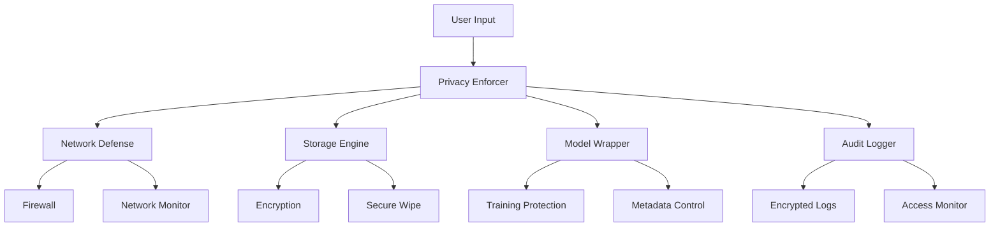
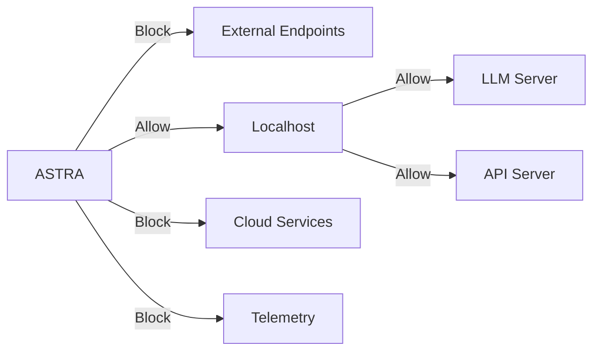
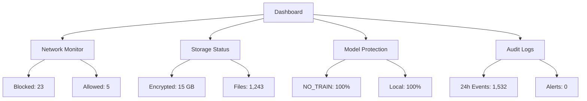

# 🛡️ ASTRA Privacy Components Guide

## Overview

This document provides detailed technical specifications for ASTRA's Privacy Protection Protocol (A.P.P.P) components.

## Component Architecture



## Components Breakdown

### 1. Privacy Enforcer (privacy_enforcer.py)

Core privacy orchestration system that manages all privacy-related operations.

#### Key Classes
- `PrivacyEnforcer`: Main privacy control system
- `NetworkDefense`: Network access control
- `StorageManager`: Secure storage operations
- `AuditSystem`: Activity monitoring

#### Configuration
```yaml
PRIVACY_MODE: STRICT
ALLOW_NETWORK: false
ALLOWED_ENDPOINTS: []
NO_TRAIN: true
```

#### Usage Example
```python
from core.privacy import get_privacy_enforcer

enforcer = get_privacy_enforcer()
enforcer.enforce_startup()
```

### 2. Storage Engine (storage.py)

Encrypted storage system for sensitive data.

#### Features
- File encryption/decryption
- Secure file operations
- Secure memory management
- Data wiping capabilities

#### Key Functions
```python
generate_and_store_key()
encrypt_bytes(data: bytes)
decrypt_bytes(token: bytes)
secure_write(path: Path, data: bytes)
secure_wipe(path: Path)
```

### 3. Model Wrapper (model_wrapper.py)

Privacy-aware AI model wrapper that prevents training data leaks.

#### Protection Methods
- Training opt-out enforcement
- Metadata sanitization
- Input/output monitoring
- Usage auditing

#### Integration Example
```python
from core.privacy import wrap_model

model = wrap_model(base_model, "llm")
response = model.generate(
    prompt="Hello",
    metadata={"user_id": "anonymous"}
)
```

### 4. Audit Logger (audit_logger.py)

Encrypted audit logging system for monitoring system access.

#### Log Categories
- File access
- Network attempts
- Model interactions
- Memory operations

#### Schema
```sql
CREATE TABLE audit_log (
    id INTEGER PRIMARY KEY,
    timestamp REAL,
    actor TEXT,
    action TEXT,
    payload BLOB,
    category TEXT
);
```

### 5. Privacy Dashboard (dashboard.py)

User interface for privacy control and monitoring.

#### Features
- Real-time status monitoring
- Log visualization
- Privacy controls
- System configuration

#### Screenshots
[Add screenshots when UI is complete]

## Network Defense Layer

### Firewall Configuration
```powershell
# Outbound blocking rule
New-NetFirewallRule -DisplayName "ASTRA_Block_Python_Outbound" `
                   -Direction Outbound `
                   -Program $pythonPath `
                   -Action Block

# Localhost allowance
New-NetFirewallRule -DisplayName "ASTRA_Allow_Python_Localhost" `
                   -Direction Inbound `
                   -LocalAddress 127.0.0.1 `
                   -Action Allow
```

### Network Protection


## Privacy Metrics & Monitoring

### Key Metrics
- Blocked connection attempts
- Encryption operations
- Model interactions
- File access patterns
- Training prevention hits

### Monitoring Dashboard


## Implementation Guide

### 1. System Integration

Add to launch_astra.py:
```python
from core.privacy import initialize_privacy_system

def main():
    # Initialize privacy system
    if not initialize_privacy_system():
        raise RuntimeError("Privacy system initialization failed")
```

### 2. Model Integration

Wrap AI models:
```python
from core.privacy import wrap_model

class ASTRACore:
    def init_models(self):
        self.llm = wrap_model(
            base_model=self.load_llm(),
            model_type="gpt-oss"
        )
```

### 3. Storage Integration

Use secure storage:
```python
from core.privacy.storage import secure_write, secure_read

def save_user_data(data: bytes):
    secure_write(Path("user_data.bin"), data)
```

### 4. Audit Integration

Add audit logging:
```python
from core.privacy.audit_logger import log_event

def process_user_input(text: str):
    log_event(
        action="user_input",
        actor="core_system",
        payload={"length": len(text)}
    )
```

## Security Considerations

### Protection Layers
1. Network isolation
2. Data encryption
3. Access control
4. Audit logging
5. Training prevention

### Security Checklist
- [ ] Privacy system initialized
- [ ] Firewall rules active
- [ ] Encryption key generated
- [ ] Audit logging enabled
- [ ] Models wrapped
- [ ] Dashboard accessible

## Troubleshooting

### Common Issues

1. Network Access Denied
```python
ConnectionError: Network access blocked by privacy policy
```
**Solution**: Add endpoint to ALLOWED_ENDPOINTS in config

2. Encryption Key Missing
```python
FileNotFoundError: Encryption key not found
```
**Solution**: Run initialize_privacy_system()

3. Model Wrapping Failed
```python
RuntimeError: Model wrapper initialization failed
```
**Solution**: Verify model compatibility and privacy mode

## Support & Maintenance

### Key Commands
```bash
# Check privacy status
python -m core.privacy.status

# View audit logs
python -m core.privacy.audit_viewer

# Start privacy dashboard
streamlit run core/privacy/dashboard.py
```

### Maintenance Tasks
1. Regular key rotation
2. Audit log cleanup
3. Firewall rule updates
4. Configuration review

## Next Steps
1. 🔧 Enhanced monitoring
2. 🔒 Additional security layers
3. 📊 Advanced metrics
4. 🌐 Web dashboard improvements

---

**Document Status**: ACTIVE  
**Last Updated**: October 18, 2025  
**Author**: Saint Lucid