# 🔧 ASTRA Privacy Protection Technical Specifications

## System Architecture

### Component Overview

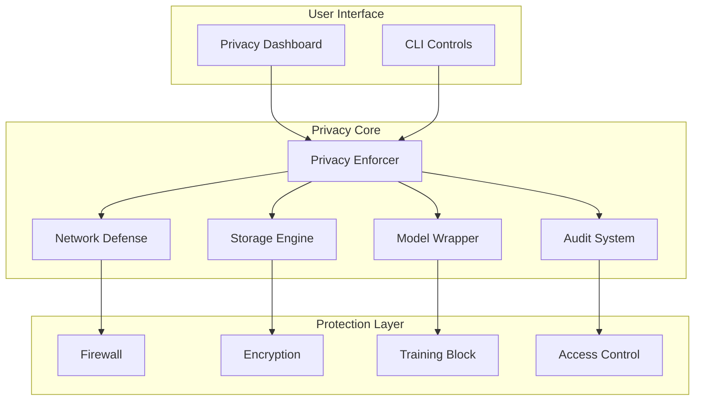

### Data Flow Architecture

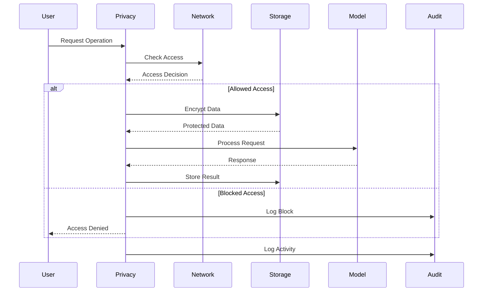

## Component Specifications

### 1. Privacy Enforcer

#### Class Diagram

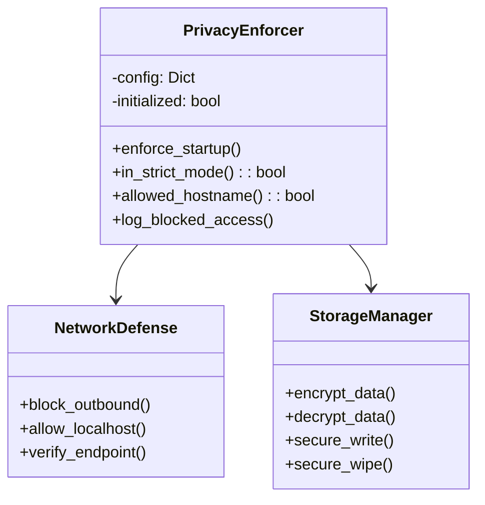

#### Configuration Schema

```yaml
PRIVACY_MODE:
    type: string
    enum: [STRICT, LENIENT]
    default: STRICT

ALLOW_NETWORK:
    type: boolean
    default: false

ALLOWED_ENDPOINTS:
    type: array
    items:
        type: string
    default: []

NO_TRAIN:
    type: boolean
    default: true

ENCRYPTION_KEY_PATH:
    type: string
    default: core/privacy/.ast_key

AUDIT_DB_PATH:
    type: string
    default: core/privacy/audit_encrypted.sqlite3

LOG_RETENTION_DAYS:
    type: integer
    default: 30
    minimum: 1

WHITELISTED_PROCESSES:
    type: array
    items:
        type: string
```

### 2. Network Defense System

#### Architecture

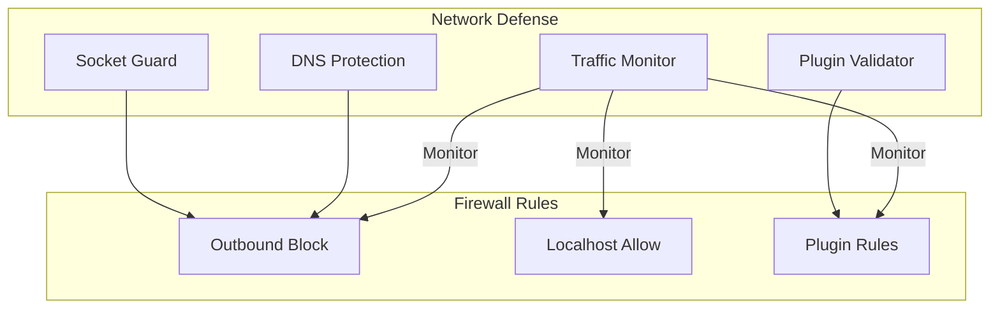

#### Firewall Configuration

```powershell
# Rule Structure
New-NetFirewallRule -DisplayName "RULE_NAME" `
                   -Direction DIRECTION `
                   -Program PROGRAM_PATH `
                   -Action ACTION `
                   -Protocol PROTOCOL `
                   -LocalAddress LOCAL_IP `
                   -Profile PROFILE
```

### 3. Storage Protection System

#### Encryption Flow

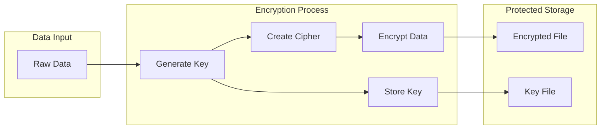

#### File Operations

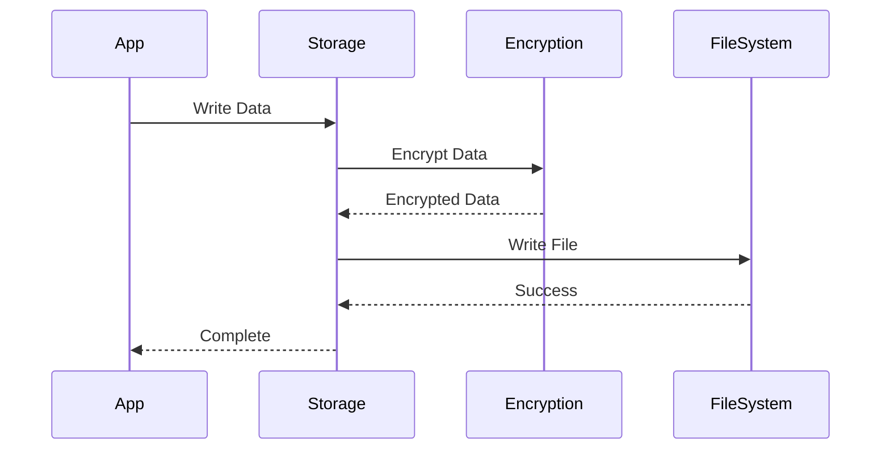

### 4. Model Protection System

#### Training Prevention

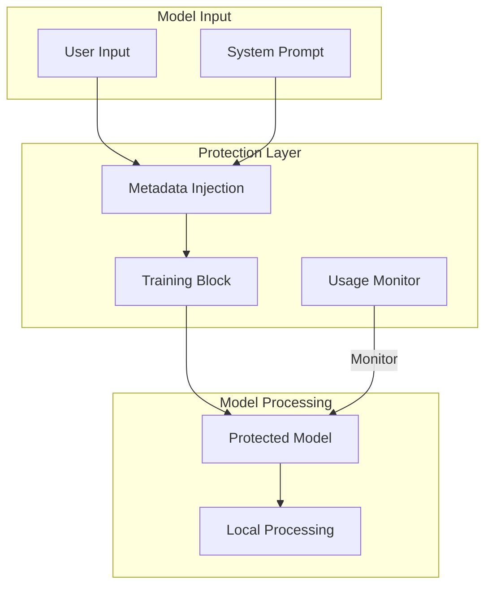

#### Metadata Structure

```json
{
    "no_train": true,
    "privacy_tag": "NO_TRAIN",
    "creator_locked": true,
    "timestamp": "2025-10-18T10:00:00Z",
    "model_type": "llm",
    "processing_mode": "local_only"
}
```

### 5. Audit System

#### Database Schema

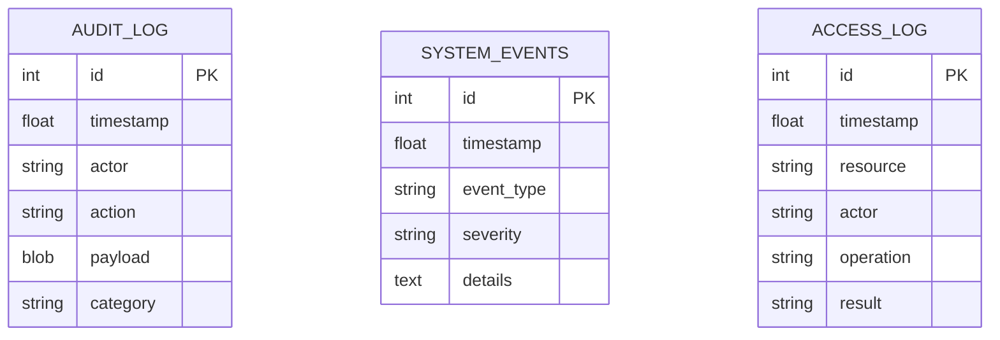

#### Monitoring Flow

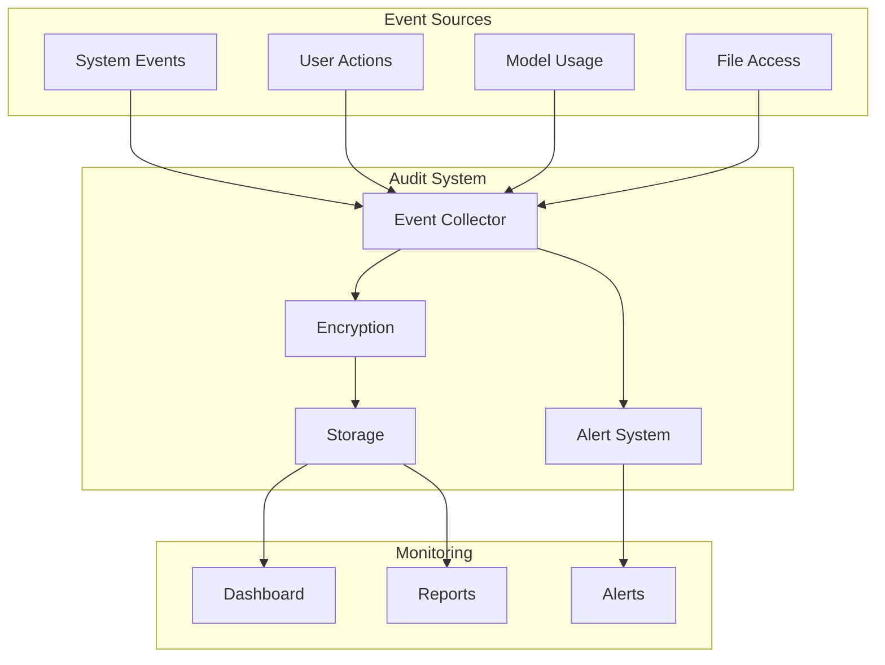

## Integration Patterns

### 1. System Initialization

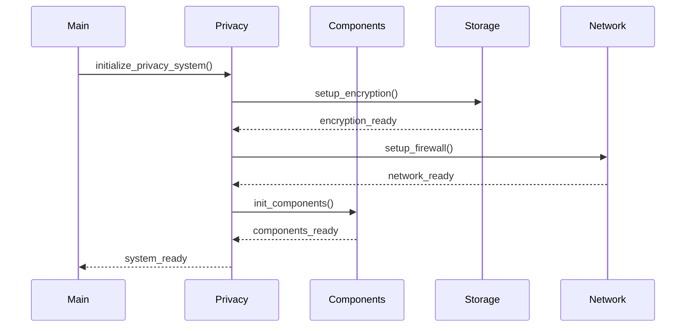

### 2. Protected Operations

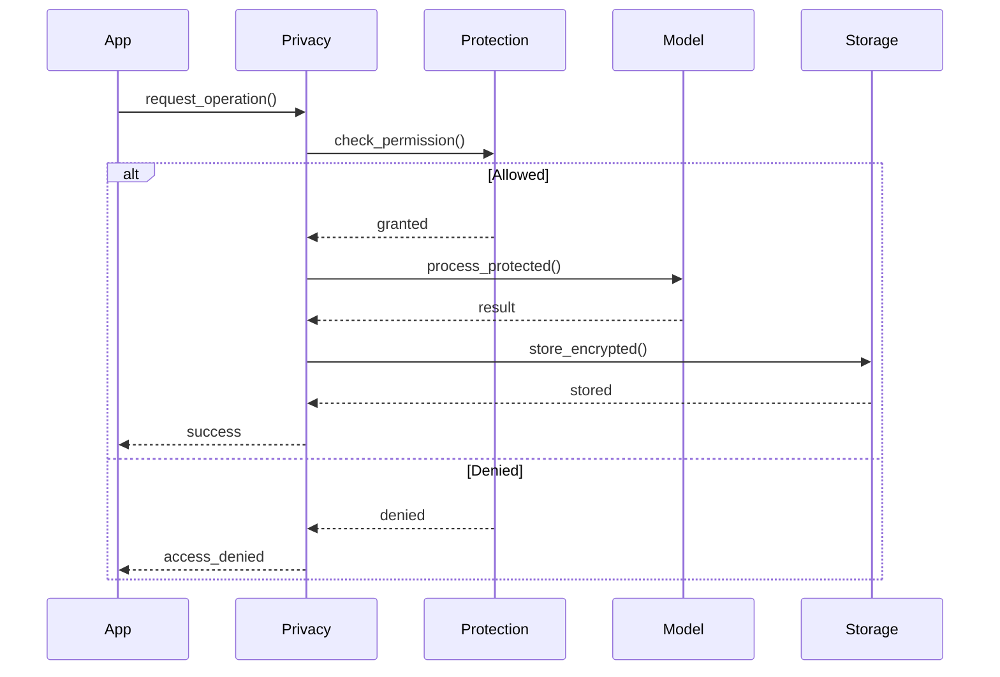

## Security Analysis

### 1. Protection Layers

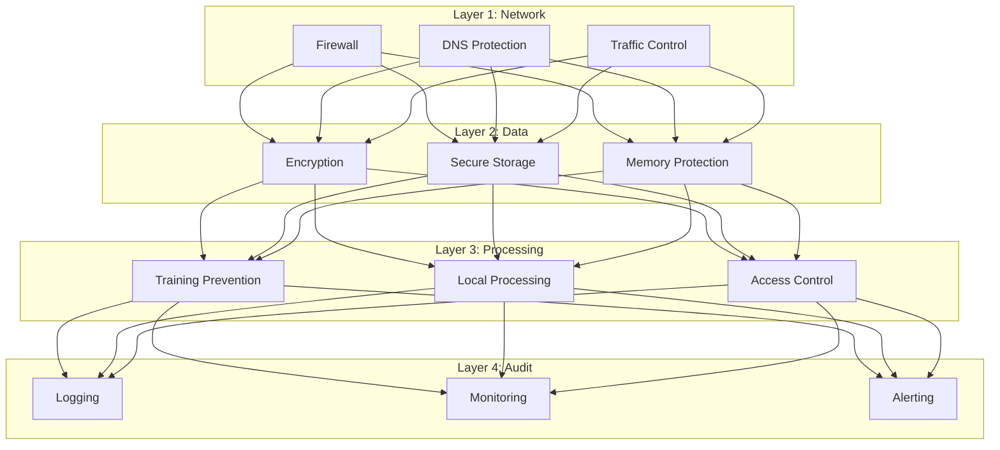

### 2. Threat Mitigations

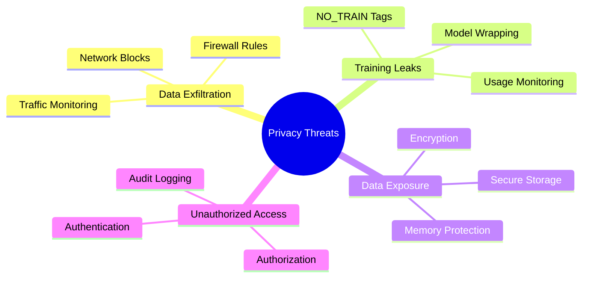

## Performance Considerations

### 1. Resource Usage

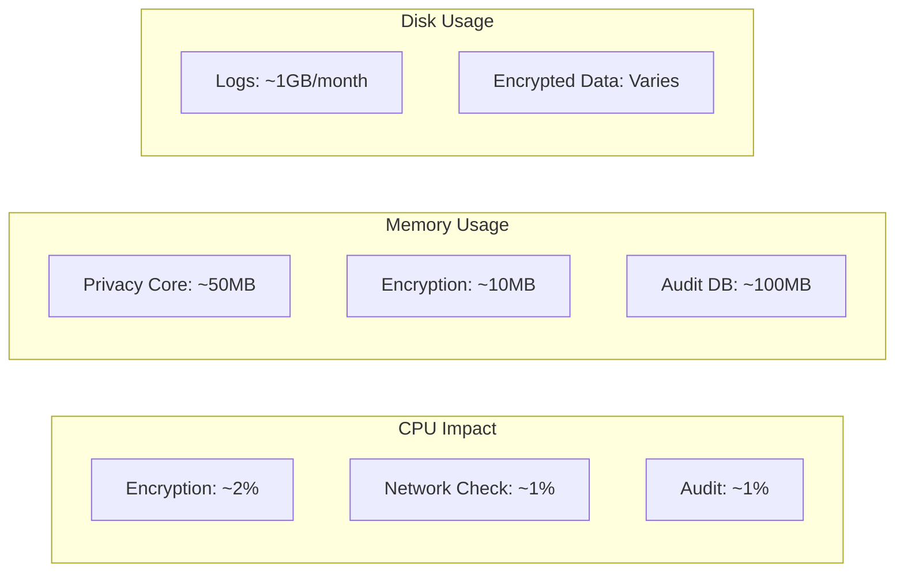

### 2. Optimization Strategies

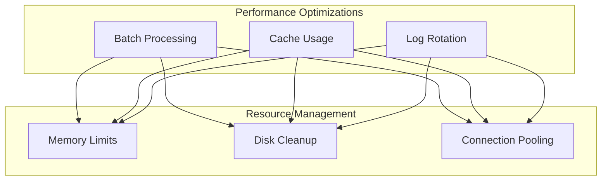

## Deployment Architecture

### Production Setup

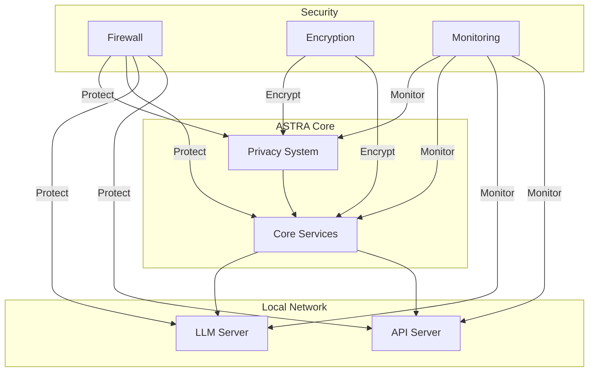

---

**Document Status**: ACTIVE  
**Last Updated**: October 18, 2025  
**Author**: Saint Lucid