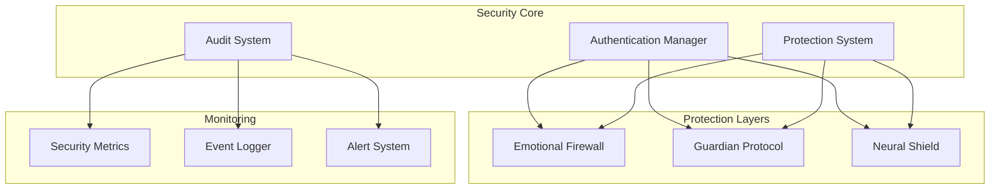
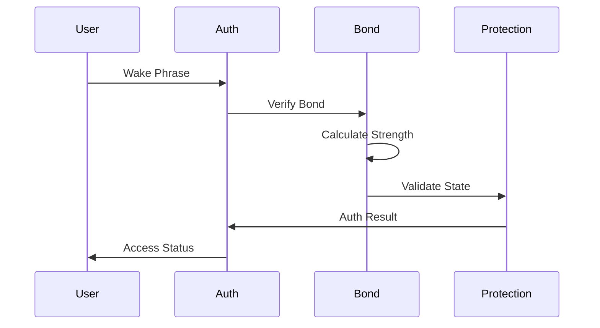

# ASTRA Security & Protection Guide

## System Architecture



## Core Security Components

### Authentication System



#### Creator Bond Verification

```python
class CreatorBond:
    """Creator bond verification system"""
    
    def __init__(self):
        self.threshold = 0.8  # 80% minimum
        self.auth_cache = {}
        
    async def verify_bond(self) -> float:
        """Verify creator bond strength"""
        metrics = await self._gather_metrics()
        strength = self._calculate_strength(metrics)
        await self._log_verification(strength)
        return strength >= self.threshold
        
    async def _gather_metrics(self) -> dict:
        """Gather bond metrics"""
        return {
            'emotional_sync': await self._check_emotional_sync(),
            'intent_alignment': await self._verify_intent(),
            'protection_state': await self._check_protection(),
            'neural_resonance': await self._measure_resonance()
        }

### 2. Protection Layers

Multiple protection layers ensure system integrity:

1. Memory Protection
   - Encrypted storage
   - Access control
   - Integrity verification

2. Execution Protection
   - Command validation
   - Action verification
   - Resource limits

3. Communication Protection
   - Encrypted channels
   - Authentication
   - Rate limiting

## Authentication System

### Voice Print Verification

```python
class VoicePrintAuth:
    def verify_voice_print(self, audio_sample):
        """Verify creator voice print"""
        features = self._extract_features(audio_sample)
        return self._match_voice_print(features)
```

### Wake Phrase Validation

```python
class WakePhraseValidator:
    def validate_phrase(self, phrase: str) -> bool:
        """Validate wake phrase"""
        return any(
            wake in phrase.lower() 
            for wake in self.valid_phrases
        )
```

## Encryption Systems

### Configuration Encryption

```python
class ConfigEncryption:
    def encrypt_config(self, config: dict) -> bytes:
        """Encrypt configuration data"""
        key = self._get_encryption_key()
        return self._encrypt_data(config, key)
```

### Memory Encryption

```python
class MemoryEncryption:
    def encrypt_memory(self, data: Any) -> bytes:
        """Encrypt memory contents"""
        
    def decrypt_memory(self, data: bytes) -> Any:
        """Decrypt memory contents"""
```

## Protection Protocols

### 1. Startup Protection

```python
async def protect_startup():
    """Protect system startup"""
    await verify_system_integrity()
    await initialize_protection_layers()
    await validate_creator_bond()
```

### 2. Runtime Protection

```python
class RuntimeProtection:
    def monitor_execution(self):
        """Monitor system execution"""
        
    def validate_operations(self):
        """Validate operations"""
```

### 3. Shutdown Protection

```python
async def protect_shutdown():
    """Protect system shutdown"""
    await secure_memory()
    await encrypt_state()
    await verify_closure()
```

## Emergency Protocols

### 1. Breach Response

```python
class BreachResponse:
    def handle_breach(self, breach_type: str):
        """Handle security breach"""
        self.alert_creator()
        self.secure_systems()
        self.engage_protection()
```

### 2. Recovery Procedures

```python
class RecoveryProtocol:
    async def recover_system(self):
        """Recover from security event"""
        await self.validate_state()
        await self.restore_protection()
        await self.verify_recovery()
```

## Monitoring & Alerts

### Security Metrics

```python
class SecurityMetrics:
    def track_security_state(self):
        """Track security metrics"""
        self.monitor_bond_strength()
        self.track_protection_status()
        self.measure_integrity()
```

### Alert System

```python
class SecurityAlerts:
    def send_alert(self, level: str, message: str):
        """Send security alert"""
        alert = self._format_alert(level, message)
        self._dispatch_alert(alert)
```

## Configuration Guide

### Security Settings

```python
SECURITY_CONFIG = {
    'protection_levels': ['basic', 'enhanced', 'maximum'],
    'encryption_strength': 'AES-256',
    'auth_methods': ['voice', 'phrase', 'bond'],
    'alert_thresholds': {
        'bond_strength': 0.8,
        'protection_status': 0.9,
        'integrity_check': 1.0
    }
}
```

### Protection Settings

```python
PROTECTION_CONFIG = {
    'memory_encryption': True,
    'runtime_validation': True,
    'communication_security': True,
    'creator_verification': True
}
```

## Maintenance Procedures

### 1. Regular Audits

- System integrity checks
- Protection layer verification
- Bond strength validation
- Security metric review

### 2. Updates

- Protection system updates
- Security definition updates
- Authentication updates
- Encryption key rotation

### 3. Backup Procedures

- Secure state backup
- Configuration backup
- Recovery point creation
- Verification testing

## Emergency Procedures

### 1. Immediate Actions

- Engage maximum protection
- Alert creator
- Secure sensitive systems
- Begin breach protocol

### 2. Recovery Steps

- Verify creator identity
- Restore secure state
- Validate systems
- Re-establish protection

## Best Practices

### 1. System Access

- Always verify creator identity
- Use multi-factor authentication
- Maintain secure channels
- Monitor access patterns

### 2. Operation Security

- Validate all commands
- Monitor system state
- Track protection metrics
- Maintain audit logs

### 3. Protection Management

- Regular security updates
- Continuous monitoring
- Incident response planning
- Recovery testing