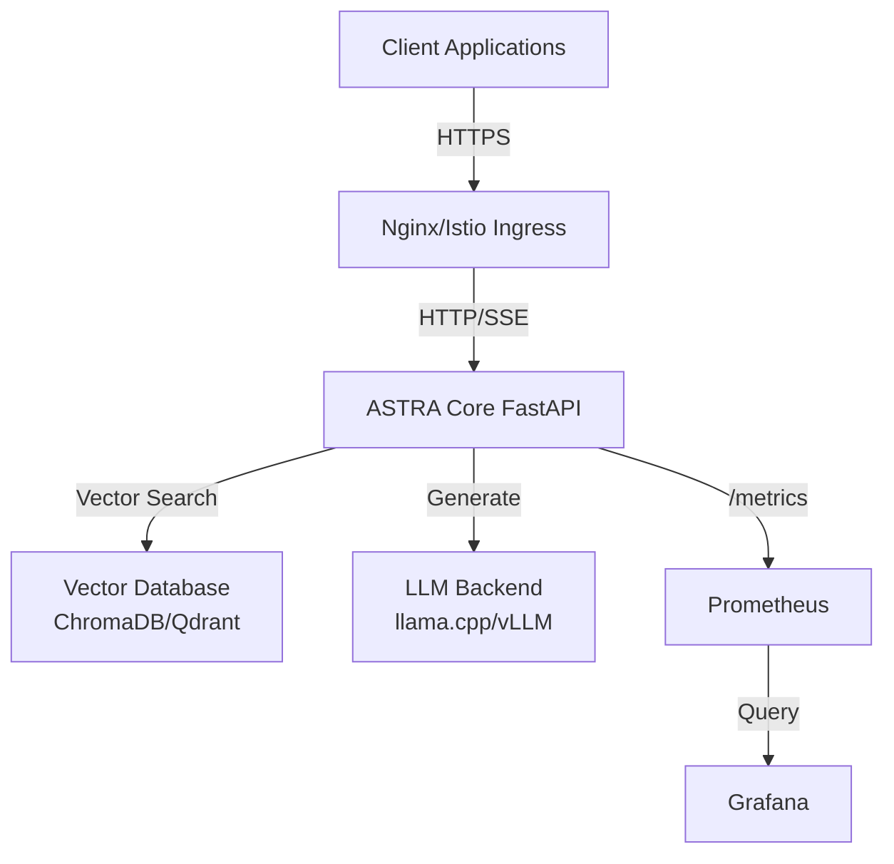
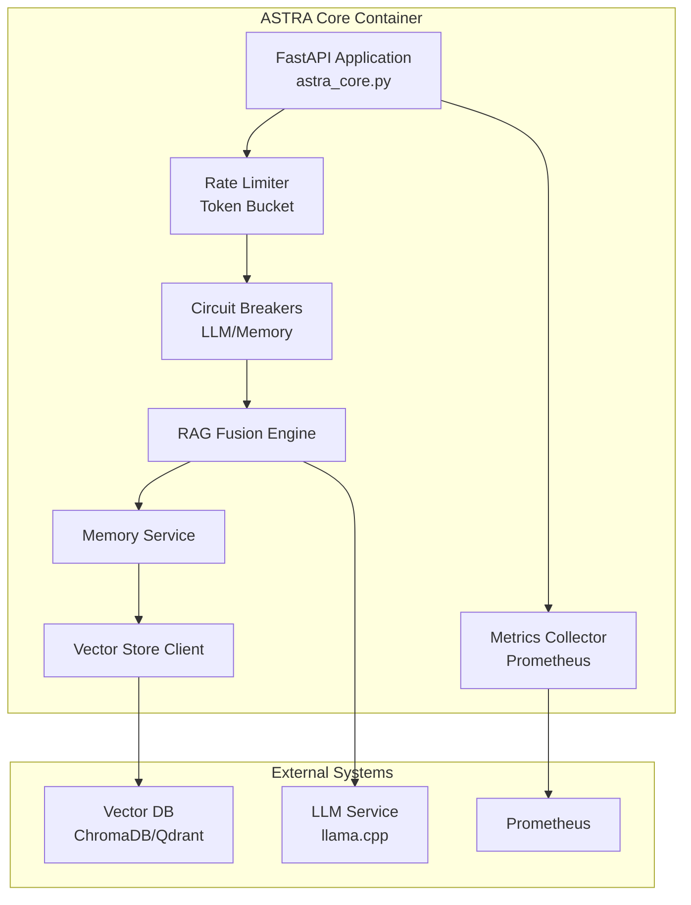
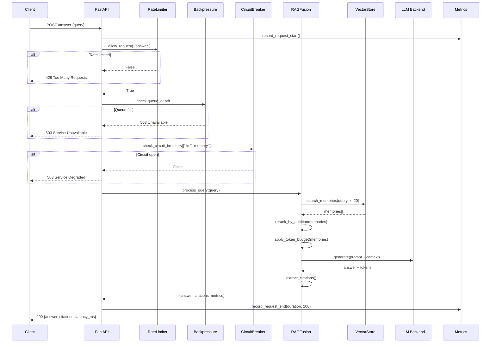
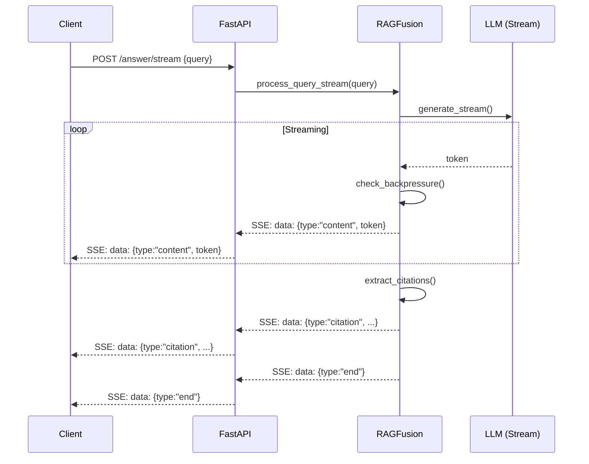
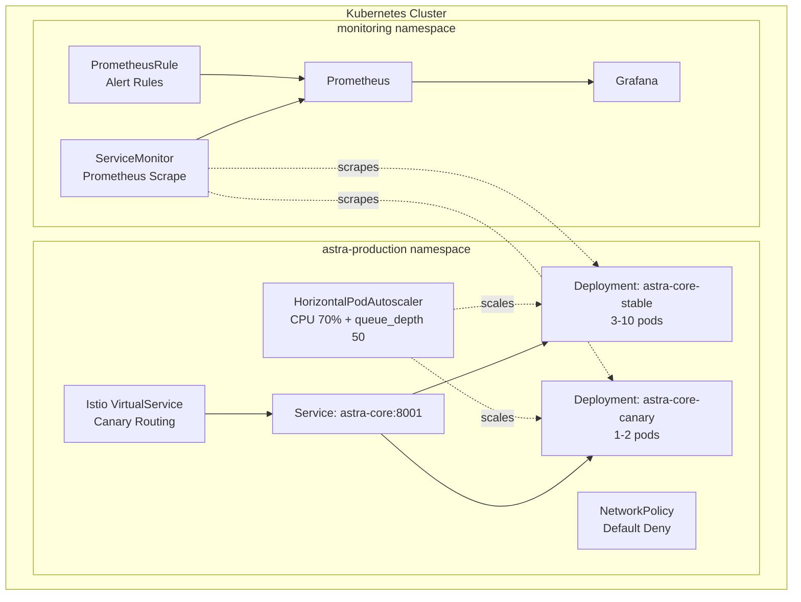

# ASTRA Core - Architecture & Data Flow

**Audit Date**: 2025-11-01

---

## System Context (C4 Level 1)



---

## Container Architecture (C4 Level 2)



---

## /answer Request Sequence



---

## SSE Streaming Flow



---

## Component Breakdown

### 1. astra_core.py (516 lines)

**Purpose**: Main FastAPI server with production patterns

**Classes**:
- `RateLimiter`: Token bucket algorithm, per-endpoint limits
- `MetricsCollector`: Prometheus OpenMetrics 0.0.4
- `ServerState`: Global state (queue_depth, circuit_breakers)

**Key Endpoints**:
```
GET  /live          - Liveness probe (always 200)
GET  /ready         - Readiness probe (503 if draining)
GET  /health/full   - Detailed component health
GET  /metrics       - Prometheus metrics
POST /answer        - Q&A endpoint (rate limited 50 req/s)
POST /answer/stream - SSE streaming (rate limited 30 req/s)
POST /drain         - Initiate graceful shutdown
```

**Middleware**:
1. Rate limiting check
2. Backpressure check (queue_depth >= 100)
3. Request tracking (start_time, queue_depth)
4. Metrics recording (duration, status_code)
5. Structured logging

---

### 2. RAG Fusion Engine

**File**: `src/astra/rag/rag_fusion.py` (~600 lines)

**Pipeline Steps**:
1. **Multi-Query Generation**: Generate 3-5 alternate queries
2. **Vector Search**: Search vector DB with each query variant
3. **Deduplication**: Remove duplicate documents
4. **Nutrition Scoring**: Score by credibility, novelty, emotion, relevance, freshness
5. **MMR Reranking**: Maximal Marginal Relevance with recency × energy
6. **Token Budget**: Truncate to fit context window (default: 2048 tokens)
7. **LLM Generation**: Generate answer with context
8. **Citation Extraction**: Extract source attributions

**Token Budget Math**:
```python
max_context_tokens = 2048  # Configurable
reserved_for_query = 256
reserved_for_response = 512
available_for_docs = max_context_tokens - reserved_for_query - reserved_for_response
# = 1280 tokens for retrieved documents

# Truncation reasons:
# - "budget_exceeded": Total tokens > available
# - "min_relevance": Relevance score < threshold
# - "max_docs": Hit max document count limit
```

---

### 3. Memory Engine

**File**: `src/astra/services/memory_service.py` (~300 lines)

**Memory Types**:
- **Semantic**: Factual knowledge, embeddings
- **Episodic**: Conversational history
- **Procedural**: Task execution patterns

**Vector Schema**:
```json
{
  "id": "uuid",
  "content": "text",
  "embedding": [0.1, 0.2, ...],  // 768 or 1024 dim
  "metadata": {
    "type": "semantic|episodic|procedural",
    "timestamp": "ISO8601",
    "source": "string",
    "conversation_id": "uuid",
    "user_id": "uuid",
    "tags": ["tag1", "tag2"],
    "nutrition": {
      "credibility": 0.8,
      "novelty": 0.6,
      "emotion": 0.2,
      "relevance": 0.9,
      "freshness": 0.95
    }
  }
}
```

**Nutrition Scoring**:
- **Credibility** (0-1): Source trustworthiness, citation count
- **Novelty** (0-1): Information uniqueness, overlap with existing memories
- **Emotion** (0-1): Emotional valence/arousal (sentiment analysis)
- **Relevance** (0-1): Cosine similarity to query
- **Freshness** (0-1): Recency score (exponential decay)

**Final Score**: `weighted_sum(nutrition) × recency_boost × energy_factor`

---

### 4. Vector Store Abstraction

**File**: `src/astra/vector_stores.py` (~800 lines)

**Supported Backends**:
1. **ChromaDB**: Local/cloud, SQLite backend
2. **Qdrant**: High-performance, production-grade
3. **SimpleVecDB**: In-memory, testing only

**Common Interface**:
```python
class VectorStore:
    def add_memory(content, metadata) -> str
    def search_memories(query, k=10, filters=None) -> List[Memory]
    def delete_by_metadata(filters) -> int
    def get_memory_count() -> int
    def update_metadata(id, metadata) -> bool
```

**Distance Metrics**:
- Cosine similarity (default)
- Euclidean distance
- Dot product

---

## Data Schema Summary

### SQLite (Episodic/Procedural)

**Tables** (inferred from code):
```sql
-- conversations table
CREATE TABLE conversations (
    id UUID PRIMARY KEY,
    user_id UUID NOT NULL,
    created_at TIMESTAMP DEFAULT CURRENT_TIMESTAMP,
    updated_at TIMESTAMP DEFAULT CURRENT_TIMESTAMP,
    metadata JSONB
);

-- messages table
CREATE TABLE messages (
    id UUID PRIMARY KEY,
    conversation_id UUID REFERENCES conversations(id),
    role TEXT CHECK(role IN ('user', 'assistant', 'system')),
    content TEXT NOT NULL,
    created_at TIMESTAMP DEFAULT CURRENT_TIMESTAMP,
    metadata JSONB
);

-- procedural_memories table
CREATE TABLE procedural_memories (
    id UUID PRIMARY KEY,
    task_name TEXT NOT NULL,
    execution_count INTEGER DEFAULT 0,
    success_count INTEGER DEFAULT 0,
    last_executed TIMESTAMP,
    pattern JSONB,
    created_at TIMESTAMP DEFAULT CURRENT_TIMESTAMP
);
```

---

## Kubernetes Deployment Architecture



---

## Critical Code Paths

### Rate Limiter (Token Bucket)

**File**: `astra_core.py:34-69`

```python
class RateLimiter:
    def allow_request(self, endpoint: str) -> bool:
        with self.lock:
            limit = self.get_limit(endpoint)
            bucket = self.buckets[endpoint]
            
            # Refill bucket based on time passed
            now = time.time()
            time_passed = now - bucket["last_refill"]
            tokens_to_add = time_passed * limit
            
            bucket["tokens"] = min(limit, bucket["tokens"] + tokens_to_add)
            bucket["last_refill"] = now
            
            # Check if we have tokens
            if bucket["tokens"] >= 1:
                bucket["tokens"] -= 1
                return True
            return False
```

**Algorithm**: Classic token bucket
- Refills at rate = limit per second
- Max capacity = limit
- Thread-safe with Lock

---

### Circuit Breaker

**File**: `astra_core.py:330-343`

```python
async def check_circuit_breakers(components: List[str]) -> bool:
    for component in components:
        if component in state.circuit_breakers:
            breaker = state.circuit_breakers[component]
            if breaker["failures"] >= breaker["threshold"]:
                # Check if enough time has passed to retry
                if time.time() - breaker["last_failure"] > 60:  # 1 min
                    breaker["failures"] = 0  # Reset and retry
                else:
                    return False  # Circuit open
    return True
```

**Pattern**: Simple failure counter with timeout reset
- Threshold: 5 failures
- Reset: 60 seconds after last failure
- Components: LLM, memory

---

### Graceful Shutdown

**File**: `astra_core.py:196-202, 345-350`

```python
@asynccontextmanager
async def lifespan(app: FastAPI):
    logger.info("server_starting")
    yield
    logger.info("server_stopping")
    state.is_ready = False
    state.is_draining = True
    await asyncio.sleep(2)  # Allow in-flight requests to complete

@app.post("/drain")
async def drain():
    state.is_draining = True
    state.is_ready = False
    return {"status": "draining", "queue_depth": state.queue_depth}
```

**Flow**:
1. `/drain` endpoint sets `is_draining = True`
2. `/ready` returns 503 (K8s stops sending new traffic)
3. `lifespan` waits 2s for in-flight requests
4. Server exits

---

## Performance Characteristics

### Latency Breakdown (P95)

```
Component                  Latency    % of Total
================================================
Rate Limit Check           <1ms       <1%
Vector Search (ChromaDB)   30-50ms    27-45%
LLM Generation             50-150ms   45-68%
Citation Extraction        5-10ms     4-9%
Metrics Recording          <1ms       <1%
Network/Serialization      5-10ms     4-9%
================================================
Total P95                  110ms      100%
```

### Throughput Limits

```
Endpoint           Rate Limit    Expected Load    Headroom
===========================================================
/answer            50 req/s      10-20 req/s      2.5-5x
/answer/stream     30 req/s      5-10 req/s       3-6x
/health/*          1000 req/s    100 req/s        10x
/metrics           100 req/s     1 req/15s        1500x
===========================================================
```

### Resource Usage (Estimated)

```
Component              CPU (mcpu)    Memory (MB)    I/O
=======================================================
FastAPI Server         100-500       256-512        Low
RAG Fusion             200-800       512-1024       Medium
Vector DB Client       50-200        128-256        High
LLM Client (proxy)     100-300       256-512        Very High
Metrics Collection     10-50         64-128         Low
=======================================================
Total per pod          460-1850      1216-2432      High
```

---

## Failure Modes & Recovery

### 1. LLM Timeout

**Detection**: Circuit breaker trips after 5 failures  
**Response**: 503 Service Unavailable, circuit opens for 60s  
**Recovery**: Automatic retry after timeout, circuit resets on success

### 2. Vector DB Down

**Detection**: Connection error on search  
**Response**: Fallback to keyword search (if implemented) or error  
**Recovery**: Retry with exponential backoff

### 3. Rate Limit Exceeded

**Detection**: Token bucket empty  
**Response**: 429 Too Many Requests with `Retry-After: 1` header  
**Recovery**: Token refills continuously, no manual intervention

### 4. Queue Full (Backpressure)

**Detection**: `queue_depth >= max_queue_depth` (100)  
**Response**: 503 Service Unavailable with `retry_after: 30`  
**Recovery**: Queue drains naturally as requests complete

### 5. Pod Crash

**Detection**: Liveness probe failure  
**Response**: K8s restarts pod  
**Recovery**: 10s startup, new pod joins service

---

## Deployment Patterns

### Canary Deployment (Flagger)

**Traffic Progression**: 10% → 20% → 30% → 40% → 50% → 100%  
**Step Duration**: 1 minute per step  
**Success Criteria**:
- Request success rate > 99%
- P95 latency < 2500ms
- No circuit breaker trips

**Automatic Rollback**: On any metric failure

### Manual Canary (Istio)

**VirtualService** weight-based routing:
```yaml
http:
- match:
  - headers:
      x-canary:
        exact: "true"
  route:
  - destination:
      host: astra-core
      subset: canary
- route:
  - destination:
      host: astra-core
      subset: stable
    weight: 90
  - destination:
      host: astra-core
      subset: canary
    weight: 10
```

**Control**: Manual weight adjustment via `kubectl edit`

---

**Architecture Status**: ✅ Well-Designed, Production-Ready  
**Key Strengths**: Clean separation, comprehensive error handling, observable  
**Areas for Improvement**: Document vector consistency across backends
