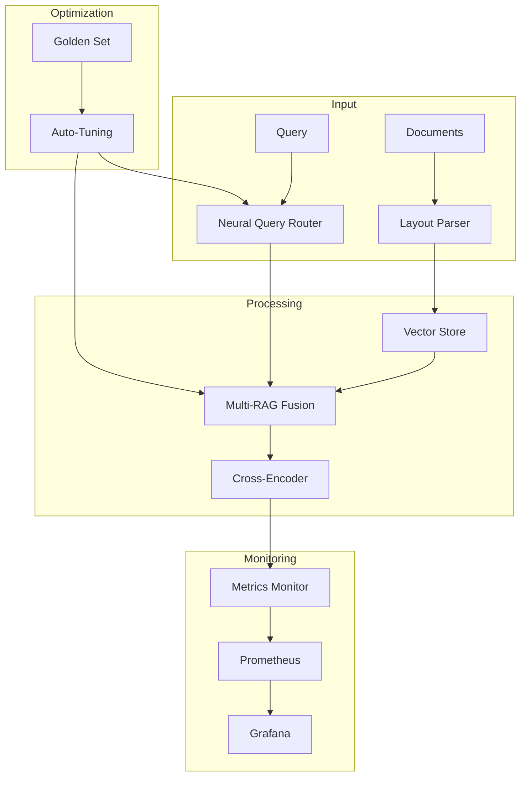
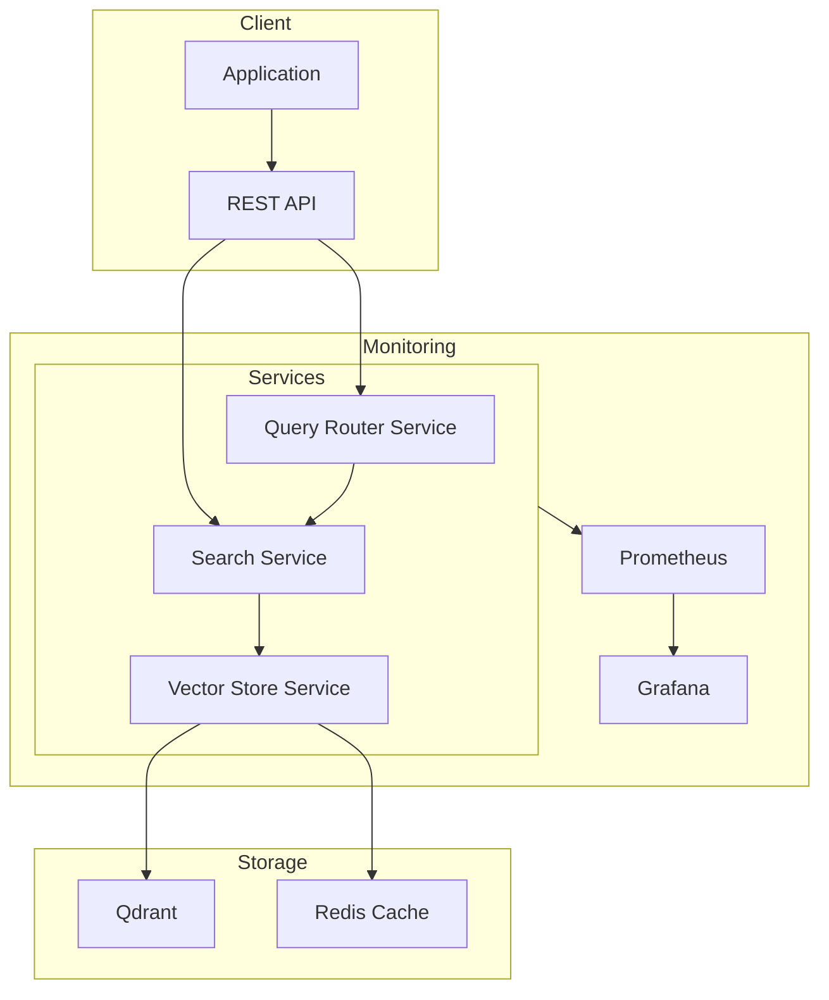

# RAG System Architecture

## Overview

The RAG (Retrieval-Augmented Generation) system is designed for high-performance, reliable document retrieval with advanced features for enhanced accuracy and maintainability.

## System Components



## Core Components

### Neural Query Router

The Query Router intelligently processes incoming queries to optimize retrieval:

1. Intent Classification
   - Neural embedding-based classification
   - Prototype matching
   - Intent-specific optimization

2. Weight Generation
   - Intent-based weight adjustment
   - Auto-calibration support
   - A/B testing capability

For details, see [Query Router Guide](query_router.md).

### Layout-Aware Parser

The Layout Parser processes documents while preserving structure:

1. Spatial Analysis
   - BoundingBox detection
   - Table preservation
   - List handling

2. Section Graph
   - Hierarchy tracking
   - Reference management
   - Context preservation

For details, see [Layout Parser Guide](layout_parser.md).

### Vector Store

The Vector Store provides efficient vector storage and retrieval:

1. HNSW Optimization
   - Fast approximate search
   - Quality/speed trade-off
   - Resource optimization

2. Reliability Features
   - Circuit breaker pattern
   - Idempotent operations
   - Cache management

For details, see [Vector Store Guide](vector_store.md).

### Multi-RAG Fusion

The Fusion component combines multiple retrieval methods:

1. Weight Management
   - Dynamic weight adjustment
   - Query-specific optimization
   - Performance tracking

2. Result Aggregation
   - Score normalization
   - Duplicate handling
   - Confidence scoring

### Cross-Encoder Reranking

The Reranker refines retrieval results:

1. Query-Document Scoring
   - Deep relevance scoring
   - Context consideration
   - Format awareness

2. Result Optimization
   - Score calibration
   - Diversity promotion
   - Context integration

## Support Systems

### Evaluation Framework

Comprehensive system evaluation:

1. Quality Metrics
   - nDCG@k scoring
   - Hit@k measurement
   - MRR calculation

2. Monitoring
   - Real-time metrics
   - Performance tracking
   - Alert system

For details, see [Evaluation Framework](evaluation.md).

### Auto-Tuning Pipeline

Automated system optimization:

1. Weight Calibration
   - Golden set evaluation
   - A/B testing
   - Performance tracking

2. Configuration Management
   - Version control
   - Rollback support
   - Safety checks

For details, see [Auto-Tuning Guide](auto_tuning.md).

## Infrastructure

### Deployment Architecture



### Service Configuration

```yaml
services:
  router:
    replicas: 3
    resources:
      cpu: 2
      memory: 4Gi
      
  search:
    replicas: 5
    resources:
      cpu: 4
      memory: 8Gi
      
  store:
    replicas: 3
    resources:
      cpu: 2
      memory: 16Gi
```

## Performance Characteristics

### Latency Targets

| Operation | P95 Latency |
|-----------|-------------|
| Query Classification | 50ms |
| Vector Search | 100ms |
| Reranking | 150ms |
| Total Response | 300ms |

### Throughput

- Query Router: 1000 QPS
- Vector Store: 500 QPS
- Reranker: 200 QPS

### Resource Usage

- CPU: Linear scaling with QPS
- Memory: ~100MB per instance
- Storage: ~1GB per 1M documents

## Security Considerations

1. Authentication
   - JWT-based auth
   - Role-based access
   - API key management

2. Data Protection
   - Encryption at rest
   - Secure transport
   - Access logging

3. Monitoring
   - Security alerts
   - Access auditing
   - Error tracking

## Development Workflow

1. Code Changes
   - Feature branches
   - PR reviews
   - CI/CD pipeline

2. Testing
   - Unit tests
   - Integration tests
   - Performance tests

3. Deployment
   - Staging validation
   - Canary releases
   - Rollback support

## Best Practices

### Development

1. Code Quality
   - Type hints
   - Documentation
   - Error handling

2. Testing
   - Unit test coverage
   - Integration testing
   - Performance benchmarks

3. Monitoring
   - Metrics tracking
   - Alert configuration
   - Log management

### Operations

1. Deployment
   - Configuration management
   - Version control
   - Rollback procedures

2. Maintenance
   - Regular updates
   - Performance tuning
   - Backup strategy

3. Monitoring
   - Resource usage
   - Error rates
   - Performance metrics

## Future Enhancements

1. Features
   - Multi-modal support
   - Language expansion
   - Enhanced reranking

2. Performance
   - Distributed processing
   - Enhanced caching
   - Query optimization

3. Tooling
   - Admin interface
   - Debug tools
   - Analysis suite

For deployment details, see [Deployment Guide](deployment.md).