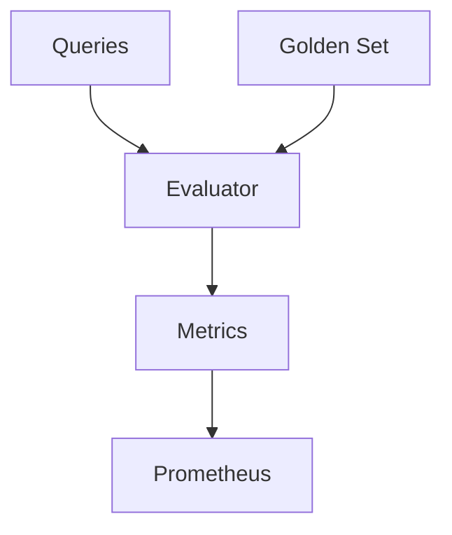

# Evaluation Framework Guide

The Evaluation Framework provides comprehensive tools for measuring and monitoring RAG system performance. This guide covers metrics, golden set management, and monitoring capabilities.

## Overview

The Evaluation Framework enables:

1. Quality metric tracking
2. Performance monitoring
3. Golden set management
4. System calibration

## Features

### Quality Metrics

- nDCG@k scoring
- Hit@k measurement
- Mean Reciprocal Rank
- Latency tracking

### Golden Set

- Query curation
- Relevance judgments
- Performance baselines
- Continuous updates

### Monitoring

- Prometheus integration
- Real-time metrics
- Alert configuration
- Dashboard support

## Configuration

```yaml
evaluation:
  metrics:
    - name: "ndcg"
      k: 10
    - name: "hit"
      k: 5
    - name: "mrr"
  golden_set: "data/golden_set.json"
  monitoring:
    prometheus_port: 9090
    update_interval: 60
```

## Usage

### Basic Evaluation

```python
from astra.rag.eval import RagEvaluator

evaluator = RagEvaluator()
scores = await evaluator.evaluate_query(
    query="How does HNSW work?",
    results=retrieved_docs,
    relevant_docs=golden_set["relevant"]
)
```

### Batch Evaluation

```python
results = await evaluator.evaluate_batch(
    queries=test_queries,
    golden_set=golden_data
)
```

### Monitoring Setup

```python
from astra.rag.eval import MetricsMonitor

monitor = MetricsMonitor()
monitor.start()
```

## Architecture



## Components

### Metrics Calculator

- NDCG computation
- Hit rate analysis
- MRR calculation
- Statistical tools

### Golden Set Manager

- Query curation
- Relevance tracking
- Set maintenance
- Version control

### Performance Monitor

- Latency tracking
- Resource usage
- Error monitoring
- Cache analysis

### Metrics Exporter

- Prometheus export
- Dashboard setup
- Alert configuration
- Data visualization

## Monitoring

### Available Metrics

```promql
# Quality Metrics
rag_ndcg_score
rag_hit_rate
rag_mrr_score

# Performance Metrics
rag_query_latency
rag_cache_hit_rate
rag_error_rate

# Resource Usage
rag_memory_usage
rag_cpu_usage
```

### Grafana Dashboard

```yaml
dashboards:
  - name: "RAG Overview"
    panels:
      - title: "Query Quality"
        metrics: ["rag_ndcg_score", "rag_hit_rate"]
      - title: "Performance"
        metrics: ["rag_query_latency", "rag_cache_hit_rate"]
```

## Best Practices

### Golden Set Management

1. Query Selection

   - Cover diverse topics
   - Include edge cases
   - Regular updates
   - Version control

2. Relevance Judgments

   - Clear criteria
   - Multiple reviewers
   - Consistent scoring
   - Regular validation

3. Maintenance

   - Regular updates
   - Quality checks
   - Performance tracking
   - Version management

## Evaluation Process

### 1. Preparation

```python
# Load golden set
golden_set = GoldenSet.load("data/golden_set.json")

# Initialize evaluator
evaluator = RagEvaluator(golden_set)
```

### 2. Evaluation

```python
# Run evaluation
results = await evaluator.evaluate_system(
    rag_system,
    queries=golden_set.queries
)
```

### 3. Analysis

```python
# Generate report
report = await evaluator.generate_report(results)
print(report.summary())
```

## API Reference

### RagEvaluator

```python
class RagEvaluator:
    def __init__(
        self,
        metrics: List[str] = ["ndcg@10", "hit@5", "mrr"]
    ):
        """Initialize evaluator with metrics."""
        
    async def evaluate_query(
        self,
        query: str,
        results: List[Document],
        relevant_docs: List[str]
    ) -> Dict[str, float]:
        """Evaluate single query results."""
        
    async def evaluate_batch(
        self,
        queries: List[str],
        golden_set: GoldenSet
    ) -> EvaluationResults:
        """Evaluate multiple queries."""
```

### MetricsMonitor

```python
class MetricsMonitor:
    def __init__(
        self,
        port: int = 9090,
        update_interval: int = 60
    ):
        """Initialize metrics monitor."""
        
    def record_metric(
        self,
        name: str,
        value: float,
        labels: Dict[str, str] = None
    ):
        """Record metric value."""
        
    async def start(self):
        """Start metrics server."""
```

## Alert Configuration

```yaml
alerts:
  - name: "LowNDCG"
    condition: "rag_ndcg_score < 0.7"
    duration: "5m"
    severity: "warning"
    
  - name: "HighLatency"
    condition: "rag_query_latency > 500ms"
    duration: "1m"
    severity: "critical"
```

## See Also

- [Query Router Guide](query_router.md)
- [Vector Store Guide](vector_store.md)
- [Auto-Tuning Guide](auto_tuning.md)
- [Deployment Guide](deployment.md)