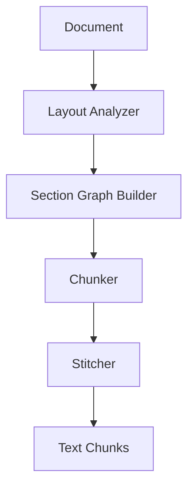

# Layout-Aware Parser Guide

The Layout-Aware Parser is a sophisticated document processing component that understands document structure and spatial relationships. This guide covers its features, configuration, and usage.

## Overview

The Layout Parser uses advanced techniques to:

1. Analyze document layout and structure
2. Maintain spatial relationships between elements
3. Intelligently chunk content
4. Preserve formatting and context

## Features

### Spatial Analysis

- BoundingBox-based element detection
- Table and list preservation
- Heading hierarchy tracking
- Image placement recognition

### Section Graph

- Document structure analysis
- Parent-child relationships
- Cross-reference tracking
- Context preservation

### Smart Chunking

- Adaptive chunk sizing
- Overlap optimization
- Format preservation
- Context stitching

## Configuration

```yaml
parser:
  chunk_size: 512
  chunk_overlap: 128
  preserve_tables: true
  section_markers:
    - type: "heading"
      patterns: ["^#{1,6}", "^[A-Z]\\.[\\s]"]
    - type: "list"
      patterns: ["^[\\-\\*]", "^\\d+\\."]
```

## Usage

### Basic Parsing

```python
from astra.rag.parser import LayoutParser

parser = LayoutParser()
chunks = await parser.parse_document("document.pdf")
```

### Custom Configuration

```python
config = {
    "chunk_size": 768,
    "chunk_overlap": 192,
    "preserve_tables": true
}
parser = LayoutParser(config=config)
```

### Batch Processing

```python
documents = ["doc1.pdf", "doc2.pdf", "doc3.pdf"]
chunks = await parser.parse_batch(documents)
```

## Architecture



## Components

### Layout Analyzer

- PDF element detection
- Table recognition
- List identification
- Image processing

### Section Graph Builder

- Hierarchy analysis
- Reference tracking
- Context mapping
- Structure preservation

### Smart Chunker

- Size optimization
- Overlap management
- Format retention
- Boundary handling

### Context Stitcher

- Adjacent chunk linking
- Context preservation
- Reference resolution
- Metadata handling

## Monitoring

### Metrics

- `parser_chunk_count`: Number of chunks generated
- `parser_processing_time`: Document processing latency
- `parser_error_rate`: Processing errors
- `parser_chunk_size_distribution`: Chunk size stats

### Logging

```python
import logging
logger = logging.getLogger("rag.parser")
logger.setLevel(logging.INFO)
```

## Best Practices

### Document Processing

- Use appropriate chunk sizes
- Maintain sufficient overlap
- Preserve important formatting
- Handle special characters

### Performance Optimization

- Batch similar documents
- Cache processed results
- Monitor resource usage
- Handle large documents efficiently

### Quality Assurance

- Validate chunk boundaries
- Verify context preservation
- Check reference integrity
- Monitor chunking quality

## Troubleshooting

### Common Issues

1. Poor Chunking

   - Review chunk size settings
   - Check overlap configuration
   - Verify format preservation
   - Monitor boundary handling

2. Performance Problems

   - Optimize batch sizes
   - Check resource usage
   - Review caching strategy
   - Monitor processing time

3. Integration Issues

   - Verify input formats
   - Check output handling
   - Review API usage
   - Monitor error rates

## API Reference

### LayoutParser

```python
class LayoutParser:
    def __init__(
        self,
        config: Optional[Dict] = None
    ):
        """Initialize parser with configuration."""
        
    async def parse_document(
        self,
        document_path: Path
    ) -> List[TextChunk]:
        """Parse single document into chunks."""
        
    async def parse_batch(
        self,
        documents: List[Path]
    ) -> Dict[Path, List[TextChunk]]:
        """Process multiple documents in batch."""
```

### TextChunk

```python
class TextChunk:
    def __init__(
        self,
        text: str,
        bbox: BoundingBox,
        metadata: Dict
    ):
        """Initialize text chunk with spatial info."""
        
    def get_context(
        self
    ) -> Dict[str, Any]:
        """Get chunk context and metadata."""
        
    def stitch(
        self,
        other: 'TextChunk'
    ) -> 'TextChunk':
        """Combine with another chunk."""
```

## See Also

- [Vector Store Guide](vector_store.md)
- [Query Router Guide](query_router.md)
- [Evaluation Framework](evaluation.md)
- [Deployment Guide](deployment.md)