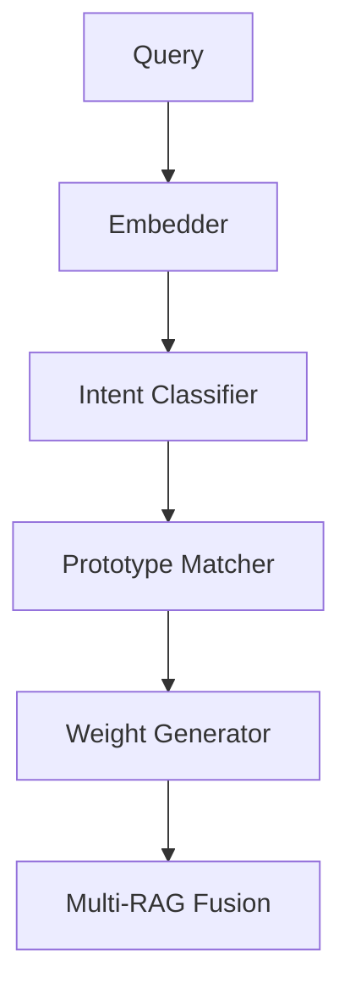

# Neural Query Router Guide

The Neural Query Router is a sophisticated component that intelligently routes and processes queries in our RAG system. This guide covers its features, configuration, and usage.

## Overview

The Query Router uses neural models to:
1. Classify query intent
2. Match against prototypes
3. Auto-tune retrieval weights
4. Optimize multi-retriever fusion

## Features

### Intent Classification
- Uses SentenceTransformers for embedding
- Matches against predefined intents
- Supports custom intent definitions
- Dynamic threshold adjustment

### Prototype Matching
- Template-based query matching
- Fuzzy matching support
- Custom prototype definition
- Weight calibration integration

### Auto-Tuning
- Golden set evaluation
- Weight optimization
- A/B testing support
- Performance monitoring

## Configuration

```yaml
router:
  model: "sentence-transformers/all-mpnet-base-v2"
  intent_threshold: 0.85
  cache_size: 10000
  prototypes:
    - name: "factual"
      examples: ["what is", "how does", "explain"]
    - name: "comparative"
      examples: ["compare", "difference between", "vs"]
```

## Usage

### Basic Usage
```python
from astra.rag.router import QueryRouter

router = QueryRouter()
intent = await router.classify_intent("How does vector search work?")
weights = router.get_weights(intent)
```

### Custom Intents
```python
intents = {
    "technical": ["how to", "implementation", "code"],
    "conceptual": ["what is", "explain", "describe"],
    "comparison": ["vs", "compare", "difference"]
}
router = QueryRouter(custom_intents=intents)
```

### Weight Calibration
```python
from astra.rag.tuning import RagCalibrator

calibrator = RagCalibrator(router=router)
await calibrator.calibrate()
```

## Architecture



## Components

### Query Embedder
- Model: all-mpnet-base-v2
- Dimension: 768
- Normalized vectors
- Cached embeddings

### Intent Classifier
- Neural classification
- Confidence scoring
- Threshold filtering
- Intent hierarchy

### Prototype Matcher
- Template matching
- Similarity scoring
- Dynamic weighting
- Performance tracking

### Weight Generator
- Intent-based weights
- Auto-calibration
- A/B testing
- Monitoring

## Monitoring

### Metrics
- `router_intent_confidence`: Intent classification confidence
- `router_latency`: Processing time
- `router_cache_hits`: Cache effectiveness
- `router_error_rate`: Classification errors

### Logging
```python
import logging
logger = logging.getLogger("rag.router")
logger.setLevel(logging.INFO)
```

## Best Practices

### Intent Definition
- Use clear, distinct intents
- Provide diverse examples
- Update prototypes regularly
- Monitor classification accuracy

### Performance Optimization
- Enable caching
- Batch similar queries
- Use appropriate thresholds
- Monitor resource usage

### Maintenance
- Regular model updates
- Prototype refinement
- Cache management
- Performance monitoring

## Troubleshooting

### Common Issues

1. Poor Classification
   - Check intent definitions
   - Verify threshold settings
   - Review example queries
   - Update prototypes

2. Performance Issues
   - Check cache settings
   - Monitor batch sizes
   - Review resource usage
   - Optimize thresholds

3. Integration Problems
   - Verify configurations
   - Check model compatibility
   - Review API usage
   - Monitor system logs

## API Reference

### QueryRouter

```python
class QueryRouter:
    def __init__(
        self,
        model: str = "all-mpnet-base-v2",
        threshold: float = 0.85,
        cache_size: int = 10000
    ):
        """Initialize router with model and settings."""
        
    async def classify_intent(
        self,
        query: str
    ) -> Tuple[str, float]:
        """Classify query intent with confidence."""
        
    def get_weights(
        self,
        intent: str
    ) -> Dict[str, float]:
        """Get retriever weights for intent."""
        
    async def calibrate(
        self,
        golden_set: List[Dict]
    ) -> CalibrationResult:
        """Calibrate weights using golden set."""
```

### RagCalibrator

```python
class RagCalibrator:
    def __init__(
        self,
        router: QueryRouter,
        golden_set_path: Path
    ):
        """Initialize calibrator."""
        
    async def calibrate(
        self
    ) -> CalibrationResult:
        """Run calibration process."""
        
    async def start_ab_test(
        self,
        test_weights: Dict[str, float],
        duration: int = 24
    ) -> ABTestResult:
        """Start A/B test with weights."""
```

## See Also

- [Multi-RAG Fusion Guide](multi_rag.md)
- [Evaluation Framework](evaluation.md)
- [Auto-Tuning Guide](auto_tuning.md)
- [Deployment Guide](deployment.md)