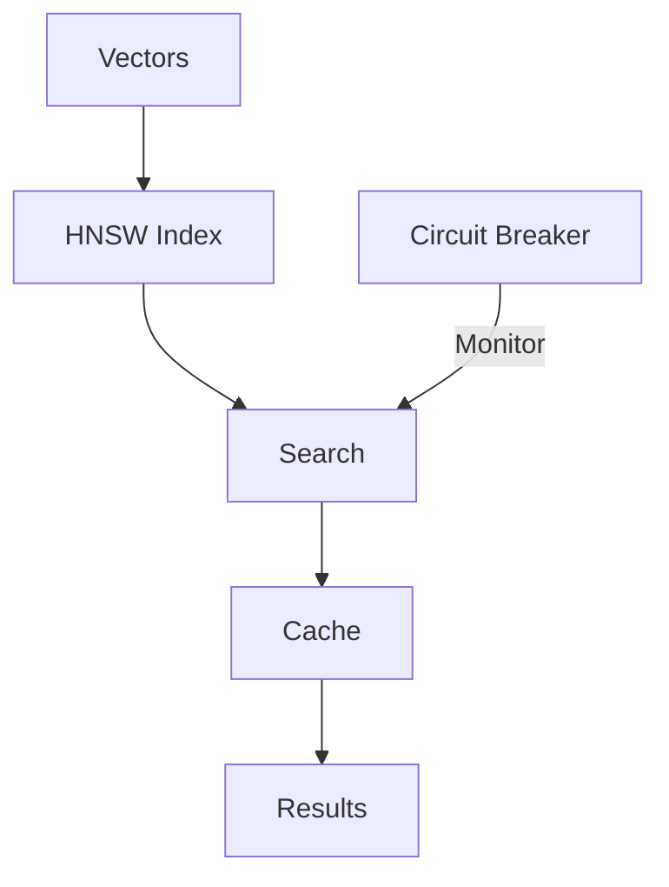

# Vector Store Guide

The Vector Store component provides high-performance, reliable vector storage and retrieval using Qdrant. This guide covers its features, configuration, and usage.

## Overview

The Vector Store provides:

1. HNSW-optimized vector search
2. Reliable data operations
3. Distributed caching
4. Performance monitoring

## Features

### HNSW Optimization

- Optimized index parameters
- Fast approximate search
- Quality/speed trade-off control
- Resource usage optimization

### Reliability

- Circuit breaker pattern
- Idempotent operations
- Error recovery
- Data consistency

### Caching

- Consistent hash sharding
- Read replica support
- Cache invalidation
- Hit rate monitoring

## Configuration

```yaml
store:
  collection: "documents"
  vector_size: 768
  distance: "cosine"
  hnsw:
    m: 32
    ef_construct: 128
    ef_search: 100
  circuit_breaker:
    failure_threshold: 5
    reset_timeout: 30
  cache:
    size: 10000
    ttl: 3600
```

## Usage

### Basic Operations

```python
from astra.rag.store import QdrantStore

store = QdrantStore()
await store.upsert(vectors, metadata)
results = await store.search(query_vector, limit=10)
```

### Batch Operations

```python
vectors = [v1, v2, v3]
metadata = [m1, m2, m3]
await store.batch_upsert(vectors, metadata)
```

### Cache Management

```python
# Configure cache
store.configure_cache(size=20000, ttl=7200)

# Clear cache
await store.clear_cache()
```

## Architecture



## Components

### HNSW Index

- M-way graph connections
- Multi-level structure
- Quality parameters
- Search optimization

### Circuit Breaker

- Failure detection
- Automatic recovery
- Resource protection
- Error handling

### Cache Layer

- Consistent hashing
- Read replicas
- TTL management
- Invalidation

### Query Processor

- Vector normalization
- Distance computation
- Result filtering
- Score aggregation

## Monitoring

### Metrics

- `store_query_latency`: Search response time
- `store_cache_hit_rate`: Cache effectiveness
- `store_error_rate`: Operation errors
- `store_circuit_breaks`: Breaker trips

### Logging

```python
import logging
logger = logging.getLogger("rag.store")
logger.setLevel(logging.INFO)
```

## Best Practices

### Index Management

- Choose appropriate M value
- Balance ef_construct
- Monitor index size
- Regular optimization

### Cache Tuning

- Set appropriate TTL
- Monitor hit rates
- Size cache properly
- Handle invalidation

### Reliability

- Use circuit breakers
- Implement retries
- Monitor errors
- Regular backups

## Troubleshooting

### Common Issues

1. Search Performance

   - Check HNSW parameters
   - Review cache settings
   - Monitor resource usage
   - Optimize batch sizes

2. Cache Problems

   - Verify shard distribution
   - Check TTL settings
   - Monitor hit rates
   - Review memory usage

3. Reliability Issues

   - Check circuit breaker logs
   - Review error patterns
   - Monitor recovery
   - Verify consistency

## API Reference

### QdrantStore

```python
class QdrantStore:
    def __init__(
        self,
        collection: str = "documents",
        vector_size: int = 768,
        distance: str = "cosine"
    ):
        """Initialize store with configuration."""
        
    async def upsert(
        self,
        vectors: List[np.ndarray],
        metadata: List[Dict]
    ) -> List[str]:
        """Add or update vectors with metadata."""
        
    async def search(
        self,
        query: np.ndarray,
        limit: int = 10
    ) -> List[SearchResult]:
        """Search for similar vectors."""
```

### CircuitBreaker

```python
class CircuitBreaker:
    def __init__(
        self,
        failure_threshold: int = 5,
        reset_timeout: int = 30
    ):
        """Initialize circuit breaker."""
        
    async def execute(
        self,
        operation: Callable
    ) -> Any:
        """Execute operation with protection."""
```

## See Also

- [Query Router Guide](query_router.md)
- [Layout Parser Guide](layout_parser.md)
- [Evaluation Framework](evaluation.md)
- [Deployment Guide](deployment.md)